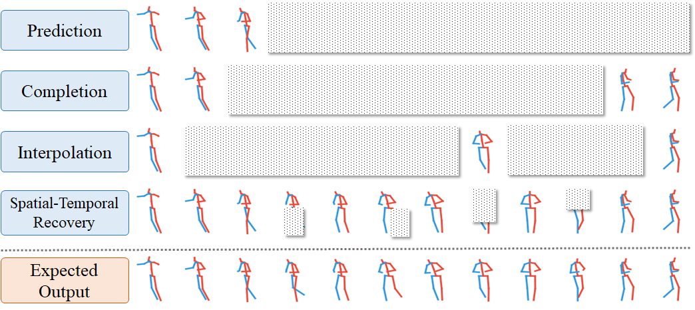

# A Unified 3D Human Motion Synthesis Model via Conditional Variational Auto-Encoder
Implementation of ICCV 2021 [Paper](https://openaccess.thecvf.com/content/ICCV2021/papers/Cai_A_Unified_3D_Human_Motion_Synthesis_Model_via_Conditional_Variational_ICCV_2021_paper.pdf) **A Unified 3D Human Motion Synthesis Model via Conditional Variational Auto-Encoder**


## Task Description
Given one masked pose seqyebce, the proposed model is able to generate plausible results.



# Getting started
## Installation
This code was tested with Pytoch 1.6.0, CUDA 10.1, Python 3.7 and Ubuntu 16.04

- Clone this repo:

```
git clone https://github.com/vanoracai/A-Unified-3D-Human-Motion-Synthesis-Model-via-Conditional-Variational-Auto-Encoder.git
cd unified_pose
```

## Datasets
download and save the file in ./data folder
- ```human3.6m```: [link](https://drive.google.com/file/d/1P7W3ldx2lxaYJJYcf3RG4Y9PsD4EJ6b0/view) 

## Start training
- Train a model using hm3.6 dataset:
see run.sh for more details.
Example: train on hm36 dataset without action label
```
python train_pose.py --config ./config/hm36/non_action_hm36.yaml
```
- Set ```--mask_type``` and ```--mask_weights```in options/base_options.py for different training masks. 
- Training models will be saved under the **saved_files/checkpoints** folder.
- Images and videos of training & testing will be founf under the **saved_files/saved_imgs/** and **saved_files/saved_videos/** folders
- The more options can be found in **options** folder.


## License
<br />This work is licensed under a <a rel="license" href="http://creativecommons.org/licenses/by-nc/4.0/">Creative Commons Attribution-NonCommercial 4.0 International License</a>.

This software is for educational and academic research purpose only. If you wish to obtain a commercial royalty bearing license to this software, please contact us at yujun001@e.ntu.edu.sg.

## Citation

If you use this code for your research, please cite our paper.
```
@inproceedings{cai2021unified,
  title={A unified 3d human motion synthesis model via conditional variational auto-encoder},
  author={Cai, Yujun and Wang, Yiwei and Zhu, Yiheng and Cham, Tat-Jen and Cai, Jianfei and Yuan, Junsong and Liu, Jun and Zheng, Chuanxia and Yan, Sijie and Ding, Henghui and others},
  booktitle={Proceedings of the IEEE/CVF International Conference on Computer Vision},
  pages={11645--11655},
  year={2021}
}
```
